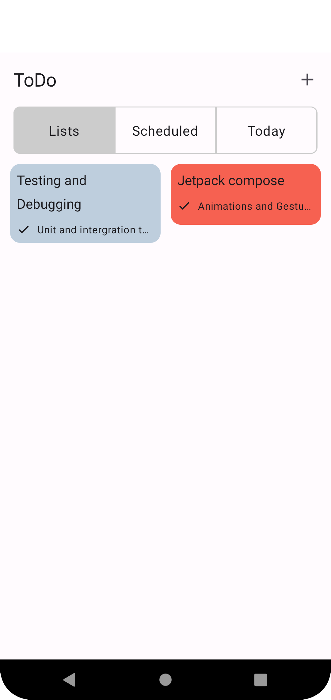
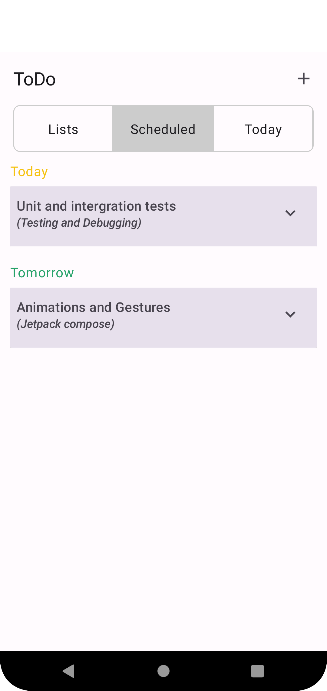
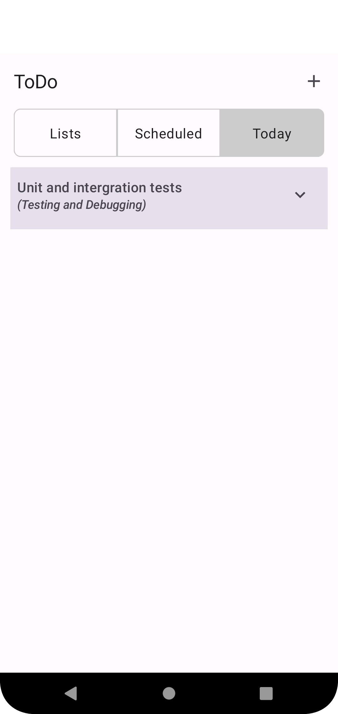
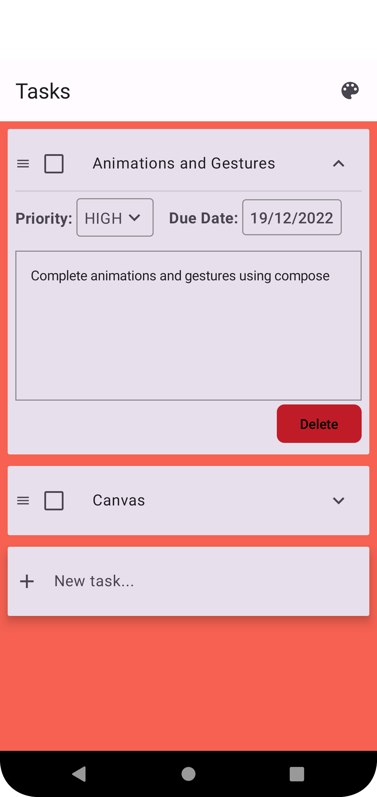

# ToDo-Reminders
This application is entirely built in Kotlin and uses Jetpack Compose.
The App is not fully completed [Work in progress 🚧]

# UI
The app is designed using [Material 3](https://m3.material.io/). The Screens and UI elements are built entirely using [Jetpack Compose](https://developer.android.com/jetpack/compose). 

The app theme supports both light and dark mode.

## Screenshots
   

The UI is inspired by [GNOME To Do](https://wiki.gnome.org/Apps/Todo)
